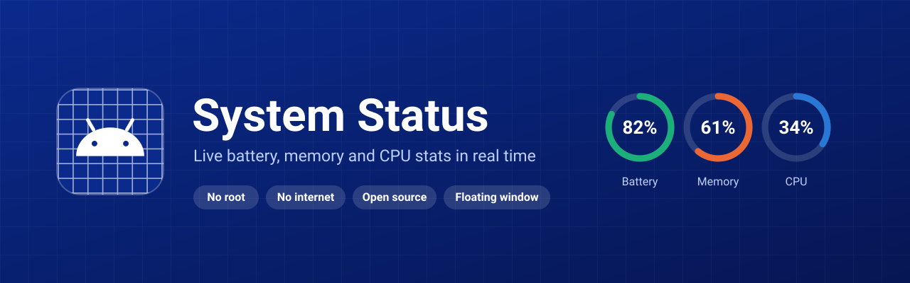
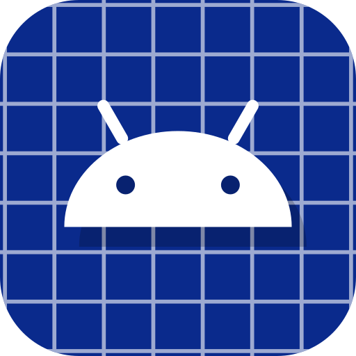

<div align="center">



<br><br>



# System Status

**Live battery, memory and CPU stats for your Android phone. No root, no internet, no ads.**

[](https://github.com/bhawan-kavinda/SysStatus/releases/latest)
[](https://github.com/bhawan-kavinda/SysStatus/releases)
[](https://github.com/bhawan-kavinda/SysStatus/actions)
[](LICENSE)


[Download](#-download) ·
[Features](#-features) ·
[Floating window](#-floating-window) ·
[Privacy](#-privacy) ·
[Build from source](#-build-from-source)

</div>

---

## About

**System Status** shows what your phone is doing right now: how the battery is charging or draining, how much RAM is in use, and how busy each CPU core is. Everything is read with normal Android APIs and system files, so it works **without root and without any special setup**.

It also has a **floating window** that sits over other apps, so you can keep an eye on the numbers while you play a game, charge your phone or run a benchmark.

When a device does not report a value, the app says **"no data"** instead of showing a made-up number.

## ✨ Features

### 🔋 Battery
- Level, charging status, plugged source, health and technology
- Voltage, current (mA) and live power (W)
- Temperature
- Time to full charge
- Cycle count, state of health and charge counter (on devices and Android versions that report them)
- Power history graph

### 🧠 Memory
- RAM in use, available, cached and buffers
- Swap usage
- Usage history graph

### ⚙️ CPU
- Total load and per-core load
- Current and maximum frequency for every core
- Governor, ABI and hardware name
- Thermal status and thermal zone temperatures
- Load history graph

### 🪟 Floating window
- Round icon with a ring that shows the battery level
- Tap the icon to open a mini panel with Battery, RAM and CPU tabs
- Move the icon anywhere; it can snap to the nearest screen edge
- Fully adjustable from the Settings screen (see below)

### 🖥️ Data log
- A terminal-style screen that shows **every system request the app makes** and the raw value Android returned
- Shows status (OK, no data, failed) and how long each call took
- Records only while the screen is open

### 🎛️ Settings
| Setting | What it does |
|---|---|
| Floating window | Turn the floating icon on or off |
| Icon size | Make the icon bigger or smaller (36 – 96 dp) |
| Icon | Pick the app icon or one of 4 custom icons |
| Transparency | Set how see-through the icon is |
| Snap to edge | Stick to the nearest side when you let go, or stay where you drop it |

Changes apply to the running floating icon straight away.

## 📥 Download

1. Open the [**Releases**](https://github.com/bhawan-kavinda/SysStatus/releases/latest) page.
2. Download the latest `.apk` file.
3. Open it on your phone and allow **Install unknown apps** for your browser or file manager when Android asks.
4. Open **System Status**.

> **Requirements:** Android 8.0 (API 26) or newer.

## 🚀 First launch

1. A sheet explains the floating window when the app opens for the first time.
2. Tap the button to open the system page and allow **Display over other apps**.
3. Go back to the app. The floating icon starts automatically.
4. On Android 13 and newer, allow notifications so the status notification can show.

You can turn the floating window on or off at any time from the **Home** or **Settings** screen, or from the **Turn off** button in the notification.

## 🔐 Permissions

| Permission | Why it is needed |
|---|---|
| `SYSTEM_ALERT_WINDOW` | Draw the floating icon and panel over other apps |
| `FOREGROUND_SERVICE` and `FOREGROUND_SERVICE_SPECIAL_USE` | Keep the floating window running in the background |
| `POST_NOTIFICATIONS` | Show the "Floating window is on" notification (Android 13+) |

The app does **not** ask for internet, storage, location, contacts or any account.

## 🛡️ Privacy

- **No internet permission.** The app cannot send anything anywhere.
- **No accounts, no analytics, no ads, no trackers.**
- **No root.** It only reads data Android already lets normal apps read.
- Backups are turned off (`allowBackup="false"`).
- Nothing is read while the screen is off.

You can check all of this yourself: the manifest is short and the source code is in this repository.

## 🔬 Where the data comes from

| Data | Source |
|---|---|
| Battery level, status, voltage, temperature, health | `ACTION_BATTERY_CHANGED` broadcast |
| Battery current, charge counter, state of health | `BatteryManager.getIntProperty(...)` |
| Time to full charge | `BatteryManager.computeChargeTimeRemaining()` |
| RAM, cached, buffers, swap | `/proc/meminfo` (falls back to `ActivityManager.getMemoryInfo()`) |
| CPU total and per-core load | `/proc/stat` |
| CPU frequency and governor | `/sys/devices/system/cpu/cpu*/cpufreq/` |
| Thermal zones | `/sys/class/thermal/thermal_zone*/temp` |
| Thermal status | `PowerManager.getCurrentThermalStatus()` |

The app refreshes every 3 seconds while it is open.

> **Note:** Android versions and manufacturers differ. Some phones hide CPU frequency or thermal files, or do not report battery cycles. Those values show **"no data"**. Open the **Data log** screen to see exactly which request returned nothing.

## 🛠️ Build from source

**You need:** JDK 17 and Gradle 8.10.2 (or Android Studio).

```bash
git clone git@github.com:bhawan-kavinda/SysStatus.git
cd SysStatus
gradle assembleRelease
```

The APK is created in `app/build/outputs/apk/release/`.

If no release keystore is provided, the build is signed with the debug key so it still succeeds.

### Signing a release

Signing values are read from environment variables and are **never stored in the repo**:

| Variable | Meaning |
|---|---|
| `KEYSTORE_PATH` | Path to the `.keystore` file |
| `KEYSTORE_PASSWORD` | Keystore password |
| `KEY_ALIAS` | Key alias |
| `KEY_PASSWORD` | Key password |

### GitHub Actions

The workflow in `.github/workflows/build.yml` builds a release APK on every push to `main` (or when started manually) and uploads it as the **SysStatus-release-apk** artifact.

To sign it with your own key, add these repository secrets:

| Secret | Value |
|---|---|
| `KEYSTORE_BASE64` | Your keystore file encoded with `base64` |
| `KEYSTORE_PASSWORD` | Keystore password |
| `KEY_ALIAS` | Key alias |
| `KEY_PASSWORD` | Key password |

To create a keystore and its base64 text:

```bash
keytool -genkey -v -keystore release.keystore -alias sysstatus \
  -keyalg RSA -keysize 2048 -validity 10000
base64 -w 0 release.keystore
```

> Keep the keystore safe. Updates must be signed with the same key as the version already installed.

## 🧱 Tech stack

- **Kotlin** with **Jetpack Compose** and Material 3
- Min SDK 26, target SDK 35
- `ViewModel` and `StateFlow` for live stats
- A foreground `Service` with a `WindowManager` overlay for the floating window
- No third-party libraries; only AndroidX and Compose

## 📂 Project structure

```
app/src/main/java/com/system/sysstatus/
├── MainActivity.kt          # Screens, permissions and floating window control
├── data/                    # Battery, memory and CPU collectors, ViewModel, request log
├── overlay/                 # Floating icon, panel, service and saved settings
└── ui/                      # Screens, nav bar, theme, icons and shared components
```

## 🗺️ Roadmap

- [ ] Home screen widgets
- [ ] More history and longer graphs
- [ ] Storage and network stats
- [ ] Export the data log

Have an idea? Open an [issue](https://github.com/bhawan-kavinda/SysStatus/issues).

## 🤝 Contributing

Bug reports and pull requests are welcome.

1. Fork the repository
2. Create a branch: `git checkout -b my-change`
3. Commit your changes and push the branch
4. Open a pull request

When reporting a bug, please include your phone model, Android version and a look at the **Data log** screen if a value is missing.

## 📄 License

Released under the [MIT License](LICENSE).

<div align="center">

<br>

Made by **[bhawan-kavinda](https://github.com/bhawan-kavinda)**

</div>
